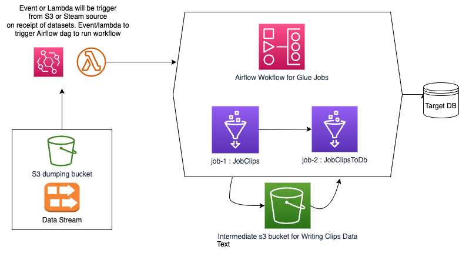

## Loco Data Engineering Case Study Tanuj Soni

Provided are my submissions for the assignments where each code is havinng some documentations stating the logics utilised by me solve this case study.

# Part 1 : Creation of Pyspark Script to calculate Clip interests
- [Logical Code for Clips](src/Clips.py)
- [Constants and path definition file](src/Constants.py)

# Part 2 : Data write to s3 or Local
- [Logical Code for Writer class to write in S3/local](src/Writer.py)

# Part 3 : Glue Jobs
- [Glue Job 1 : Clips Logic Execution](glue/JobClips.py)
- [Glue Job 2 : Interests data to Database Dump Job](glue/JobClipsToDb.py)

# Part 4 : Local Execution
- [Local Execution script for provided files](RunClipsLocal.py)

# Part 5 : Unit Tests
- [Unit Testing Class](tests/TestClips.py)
- [Unit Test Cases definition Class](tests/UnitTestCases.py)

# Part 6: Airflow Orchestration
- [Airflow Orchestration of Glue Jobs](AirflowGlue.py)

